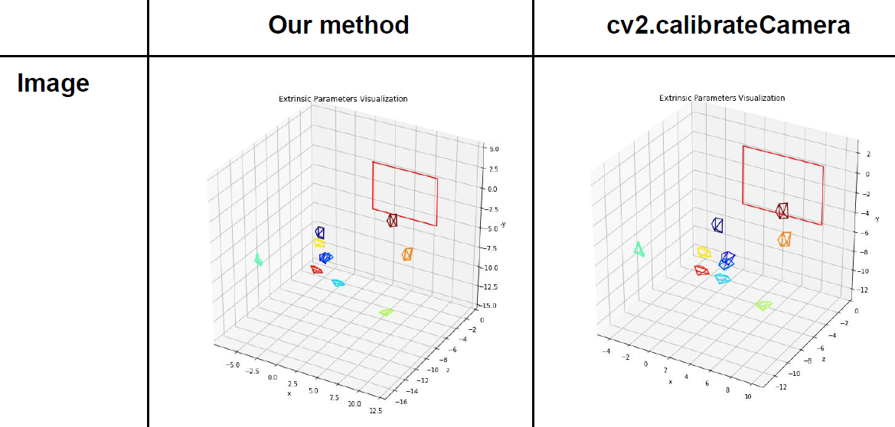
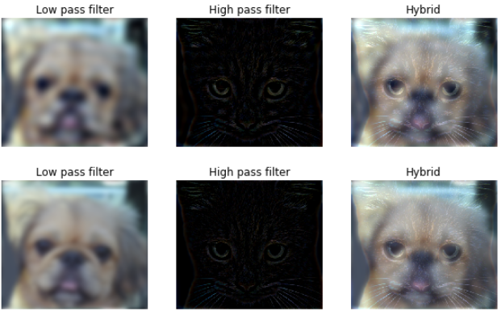
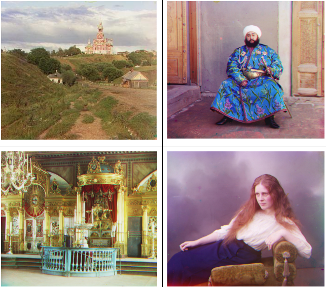
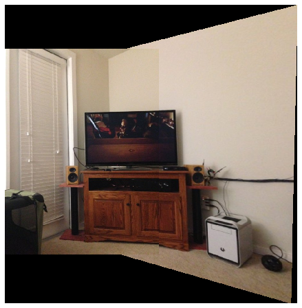
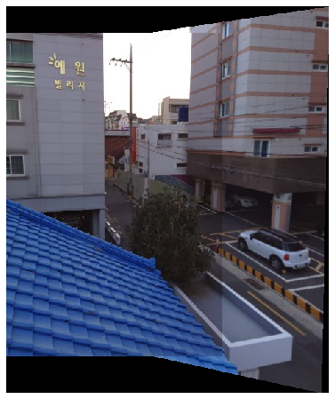
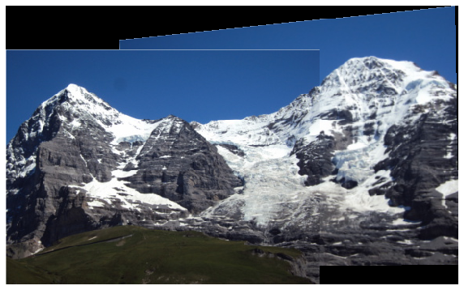
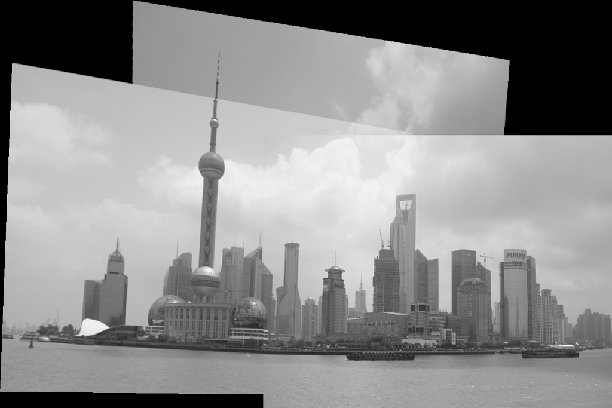

# NCTU_Computer_Vision
Assignments in NCTU Computer Vision class (ILE5062)
## HW1 - Implementation of Camera Calibration

  

## HW2
### Hybrid Image

### Image Pyramid

### Colorizing

  

## HW3 - Automatic Panoramic Image Stitching
#### Living_room

#### Roof

#### Hill

#### Shanghai

